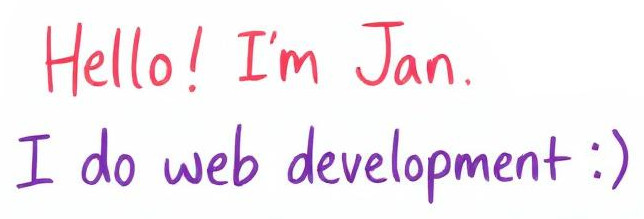

  

I'm a passionate and certified JS & Python developer, agile scrum master, UI architect, media engineer and e-mobility enthusiast based in Hamburg (Germany).

  
🔭 I’m currently open for job offers  
🌱 I’m currently learning typescript and Vue.JS  
💬 Ask me about my favourite newly discovered heavy metal bands  
😄 Pronouns: He/Him  
🤞 One day I hope to... Go skydiving!  
⚡ Fun fact: my duolingo streak is over 700. I REALLY do love languages (and the cultures behind them).  
  
 
<b> I love connecting with different people so feel free to say hi!</b>

<!--
**jspospiech/jspospiech** is a ✨ _special_ ✨ repository because its `README.md` (this file) appears on your GitHub profile.

Here are some ideas to get you started:

- 🔭 I’m currently working on ...
- 🌱 I’m currently learning ...
- 👯 I’m looking to collaborate on ...
- 🤔 I’m looking for help with ...
- 💬 Ask me about ...
- 📫 How to reach me: ...
- 😄 Pronouns: ...
- ⚡ Fun fact: ...
-->
